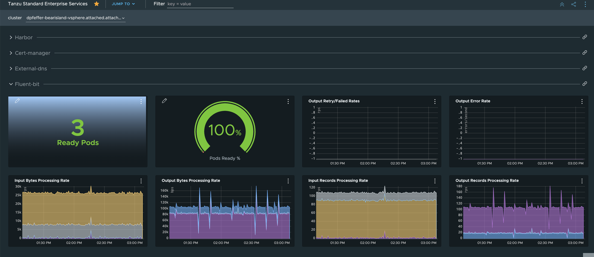

# Monitor Tanzu Standard Packages with Tanzu Observability

The Tanzu profolio consists of a number of components that can be deployed on Kubernetes.  At the base level, Tanzu offers the Tanzu Standard Package Repository that is included with Tanzu Standard entitlements.  The purpose of this repo is to show how various components provided through Tanzu can be enabled for observability.  Furthermore a sample [Tanzu Dashboard](tanzu-standard-dashboard.json) has been created that demonstrates the visualization of these Tanzu component metrics.

Please checkout companion blog post, [Monitoring Tanzu Standard Repository Enterprise Sevices](https://dodd-pfeffer.medium.com/monitoring-tanzu-standard-repository-enterprise-services-b02bc3ec6716).

## Scope and Status

Select the specific Tanzu Standard Repository package for guidance on configuration

| Component | Status |
| --- | --- |
| [External DNS](external-dns/external-dns.md) | Initial Implementation |
| [Cert Manager](cert-manager/cert-manager.md) | Initial Implementation |
| [Harbor](harbor/harbor.md) | Initial Implementation |
| [Fluent-bit](fluent-bit/fluent-bit.md) | Initial Implementation |

## Dashboard

To create the dashboard shown above, create a new dashboard with Tanzu Observability and import [tanzu-standard-dashboard.json](tanzu-standard-dashboard.json).
