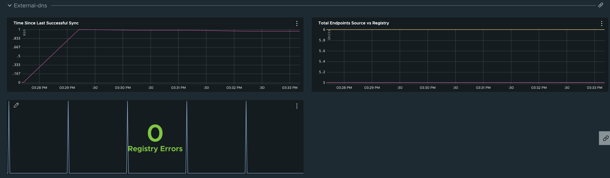

# External DNS

External DNS requires special consideration to ensure metrics are exposed by the app, and then to ensure the metrics are scrapped.

1. Ensure your data values file for external-dns includes the following deployment arg item when creating or updating the package.

```yaml
deployment:
  args:
    - --metrics-address=:7979 #! ensures external dns exposes metrics
```

2. The external-dns package does not allow you to add pod annotations via the data values file.  So we must apply a package overlay to ensure the prometheus annotations are added.

```bash
kubectl apply -f external-dns/metrics-overlay.yaml -n $INSTALLED_PACKAGE_NS
kubectl annotate PackageInstall external-dns -n $INSTALLED_PACKAGE_NS ext.packaging.carvel.dev/ytt-paths-from-secret-name.0=metrics-overlay
```

>Note: Future versions of external-dns may expose pod annotations.  See [TCE PR #5278](https://github.com/vmware-tanzu/community-edition/pull/5278)

## Dashboard Section



## References

- [List of metrics](https://github.com/kubernetes-sigs/external-dns/blob/master/docs/faq.md)