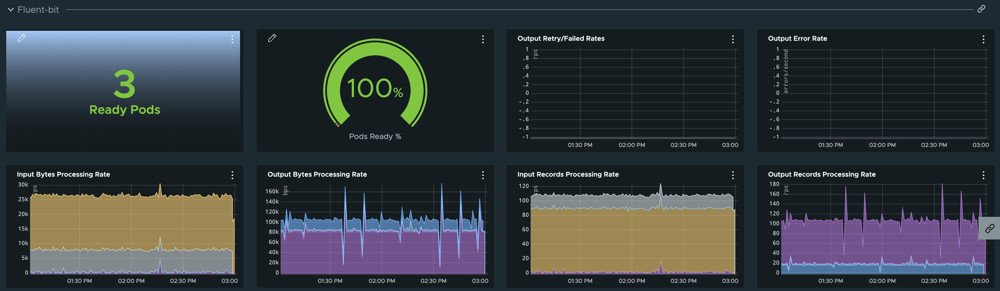

# Fluent-bit 

Fluent-bit metrics are exposed by default, but no annotations are set to advertise.  You can configure pod annotations within the data-values file to instruct Tanzu Observability to slurp them up.

```yaml
fluent_bit:
  daemonset:
    podAnnotations:
      prometheus.io/scrape: "true"
      prometheus.io/path: "/api/v1/metrics/prometheus"
      prometheus.io/port: "2020"
```

## Dashboard Section




## Reference 

- [Fluent-bit Metrics](https://docs.fluentbit.io/manual/v/1.7/administration/monitoring#metrics-in-prometheus-format)