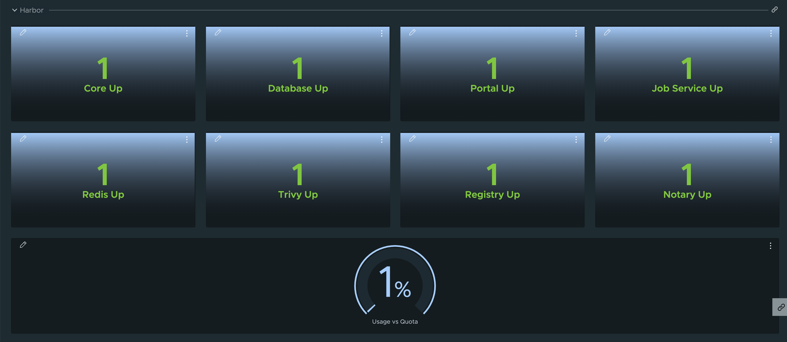

# Harbor 

Harbor metrics can be exposed by configuring the package data values.  They are disabled by default.

```yaml
metrics:
  enabled: true
```

## Dashboard Section



## Reference 

- [List of Metrics](https://goharbor.io/docs/2.3.0/administration/metrics/#harbor-exporter-metrics)